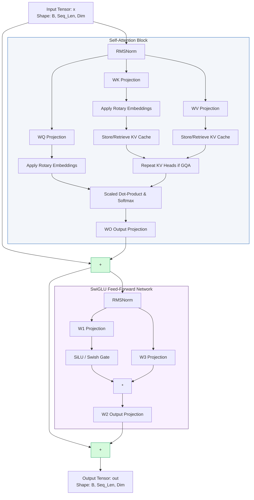
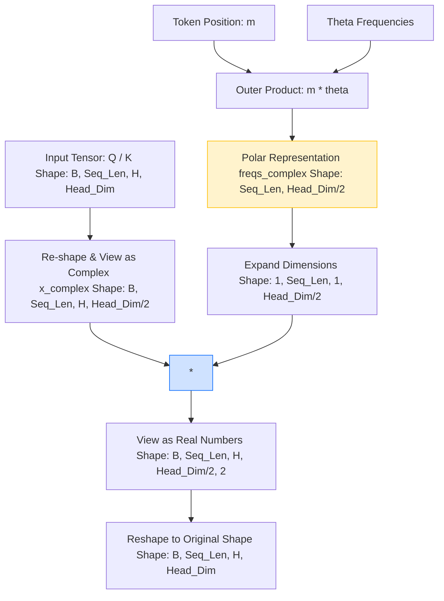
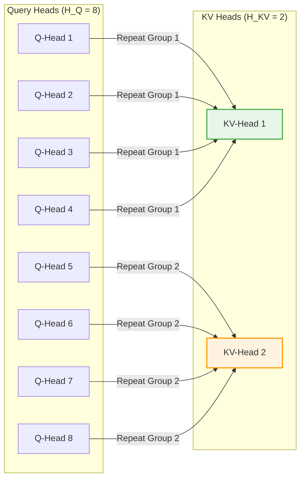

# LLaMA PyTorch Implementation

This repository contains a clean, modular, and optimized from-scratch PyTorch implementation of the **LLaMA** (specifically LLaMA 2) large language model architecture. 

It is tailored for educational purposes, inference experimentation, and examining the micro-mechanics of modern transformer models.

---

## Architecture Overview

Unlike standard Vanilla Transformers, the LLaMA architecture introduces several optimizations for efficiency, stability, and scaling:
1. **RMSNorm (Root Mean Square Normalization)**: Applied before attention and feed-forward layers.
2. **Rotary Position Embeddings (RoPE)**: Replaces absolute or relative positional embeddings with a frequency-based rotation in complex space.
3. **Grouped-Query Attention (GQA)**: Accelerates inference scale using fewer Key/Value heads than Query heads, reducing KV cache memory footprint.
4. **SwiGLU Activation FFN**: Uses gated linear units (GLUs) with SiLU (Swish) activations inside feedforward sub-layers.

Here is the computational graph of a single **Transformer Decoder Block** in LLaMA:



---

## Core Component Visualizations

### 1. Rotary Position Embeddings (RoPE)
Instead of adding positional vectors to embeddings, RoPE applies a coordinate rotation to the Query ($Q$) and Key ($K$) representations in 2D slices. This allows the inner product of Query-Key pairs to decay with relative distance.



### 2. Grouped-Query Attention (GQA)
In vanilla multi-head attention (MHA), every query head has its own key-value head. Multi-query attention (MQA) shares a single key-value head across all query heads. Grouped-Query Attention (GQA) is an optimal middle-ground: it splits query heads into $G$ groups, and each group shares unique key-value heads.

This is executed using the `repeat_kv` operation:



---

## Repository Structure

*   [`model.py`](file:///home/esraa/LLaMa/model.py): Core LLaMA architectural modules (`Transformer`, `EncoderBlock`, `SelfAttention`, `FeedForward`, `RMSNorm`, RoPE helper functions).
*   [`inference.py`](file:///home/esraa/LLaMa/inference.py): Text generation pipeline helper wrapping the tokenizer, top-p sampling, and weights loader.
*   [`verify_llama.py`](file:///home/esraa/LLaMa/verify_llama.py): Unit test and mock evaluation pipeline for verifying model structures without heavy dependencies.

---

## Getting Started

### Prerequisites

*   Python 3.8+
*   PyTorch 2.0+
*   SentencePiece

```bash
pip install torch sentencepiece tqdm
```

### Running Validation Tests
You can verify the correctness of the custom implementation (RMSNorm, Attention cache mechanism, Rotary Positional Embeddings) by running:

```bash
python verify_llama.py
```

### Loading LLaMA 2 Weights and Generating Text
Make sure you have downloaded the weights from Meta (or Hugging Face) and converted them to standard formats:

```python
from inference import LLaMA

model = LLaMA.build(
    load_model=True,
    tokenizer_path="path/to/tokenizer.model",
    checkpoints_dir="path/to/llama-2-7b/",
    max_seq_len=1024,
    max_batch_size=4,
    device="cuda"
)

out_tokens, out_texts = model.text_completion(
    prompts=["The capital of France is"],
    max_gen_len=64
)
print(out_texts[0])
```
